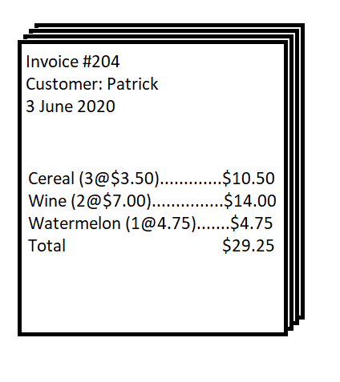

## Normalization

- the process of reducing redundancy and preventing data anomalies

1. First Normal Form

- table has a primary key
- columns hold atomic values
- no repeated columns

2. Second Normal Form

- removed partial dependencies

3. Third Normal Form

- removed transitive dependencies

## Example

**invoice**

| invoice_id | customer_name | date        | item       | price | quantity | line price | total |
| ---------- | ------------- | ----------- | ---------- | ----- | -------- | ---------- | ----- |
| 201        | Peter         | 2 June 2020 | Coffee     | 5.00  | 2        | 10.00      | 25.00 |
| 201        | Peter         | 2 June 2020 | Milk       | 3.00  | 1        | 3.00       | 25.00 |
| 201        | Peter         | 2 June 2020 | Bread      | 4.00  | 3        | 12.00      | 25.00 |
| 204        | Patrick       | 3 June 2020 | Cereal     | 3.50  | 3        | 10.50      | 29.25 |
| 204        | Patrick       | 3 June 2020 | Wine       | 7.00  | 2        | 14.00      | 29.25 |
| 204        | Patrick       | 3 June 2020 | Watermelon | 4.75  | 1        | 4.75       | 29.25 |

---

**invoice**

| _invoice_id_ | customer_name | date        | _line_number_ | item       | price | quantity | line price | total |
| ------------ | ------------- | ----------- | ------------- | ---------- | ----- | -------- | ---------- | ----- |
| 201          | Peter         | 2 June 2020 | 1             | Coffee     | 5.00  | 2        | 10.00      | 25.00 |
| 201          | Peter         | 2 June 2020 | 2             | Milk       | 3.00  | 1        | 3.00       | 25.00 |
| 201          | Peter         | 2 June 2020 | 3             | Bread      | 4.00  | 3        | 12.00      | 25.00 |
| 204          | Patrick       | 3 June 2020 | 1             | Cereal     | 3.50  | 3        | 10.50      | 29.25 |
| 204          | Patrick       | 3 June 2020 | 2             | Wine       | 7.00  | 2        | 14.00      | 29.25 |
| 204          | Patrick       | 3 June 2020 | 3             | Watermelon | 4.75  | 1        | 4.75       | 29.25 |

---

invoice_line

| invoice_id | line_number | item       | price | quantity | line price |
| ---------- | ----------- | ---------- | ----- | -------- | ---------- |
| 201        | 1           | Coffee     | 5.00  | 2        | 10.00      |
| 201        | 2           | Milk       | 3.00  | 1        | 3.00       |
| 201        | 3           | Bread      | 4.00  | 3        | 12.00      |
| 204        | 1           | Cereal     | 3.50  | 3        | 10.50      |
| 204        | 2           | Wine       | 7.00  | 2        | 14.00      |
| 204        | 3           | Watermelon | 4.75  | 1        | 4.75       |

invoice

| invoice_id | customer_name | date        | total |
| ---------- | ------------- | ----------- | ----- |
| 201        | Peter         | 2 June 2020 | 25.00 |
| 204        | Patrick       | 3 June 2020 | 29.25 |

---

invoice_line

| invoice_id | line_number | item_no | quantity |
| ---------- | ----------- | ------- | -------- |
| 201        | 1           | 73627   | 2        |
| 201        | 2           | 76283   | 1        |
| 201        | 3           | 72463   | 3        |
| 204        | 1           | 84726   | 3        |
| 204        | 2           | 83725   | 2        |
| 204        | 3           | 82617   | 1        |

invoice

| invoice_id | customer_name | date        |
| ---------- | ------------- | ----------- |
| 201        | Peter         | 2 June 2020 |
| 204        | Patrick       | 3 June 2020 |

item

| item_no | name       | price |
| ------- | ---------- | ----- |
| 73627   | Coffee     | 5.00  |
| 76283   | Milk       | 3.00  |
| 72463   | Bread      | 4.00  |
| 84726   | Cereal     | 3.50  |
| 83725   | Wine       | 7.00  |
| 82617   | Watermelon | 4.75  | 
